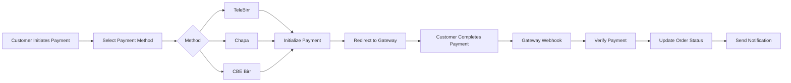

# Ethiopian E-Commerce Platform Backend

## Overview

A secure, scalable backend API for an Ethiopian e-commerce platform with integrated local payment gateways (TeleBirr, Chapa, CBE Birr). Built with Node.js, Express, and PostgreSQL.

## 🚀 Features

- **Ethiopian Payment Integration**: TeleBirr, Chapa, and CBE Birr support
- **Multi-currency Support**: Primarily ETB with conversion capabilities
- **User Management**: Authentication, authorization, and profile management
- **Product Catalog**: Categories, inventory, and pricing
- **Order Processing**: Complete order lifecycle management
- **Real-time Notifications**: Email, SMS, and in-app notifications
- **Analytics & Reporting**: Sales, user, and payment analytics
- **Admin Dashboard**: Comprehensive admin interface
- **API Documentation**: Swagger/OpenAPI documentation
- **Webhook Support**: Payment gateway webhook integration

## 📋 Prerequisites

- Node.js 16+ 
- PostgreSQL 12+
- Redis (optional, for caching)
- SMTP Server (for emails)
- Ethiopian SMS Gateway (for SMS notifications)

## 🛠️ Installation

### 1. Clone the Repository
```bash
git clone <repository-url>
cd backend
```

### 2. Install Dependencies
```bash
npm install
```

### 3. Environment Configuration
Copy `.env.example` to `.env` and configure:
```bash
cp .env.example .env
```

### 4. Configure Environment Variables
```env
# Application
NODE_ENV=development
PORT=5000
API_VERSION=v1

# Database
DB_HOST=localhost
DB_PORT=5432
DB_NAME=ethioshop
DB_USER=postgres
DB_PASSWORD=your_password
DB_SSL=false

# JWT Authentication
JWT_SECRET=your_jwt_secret_key
JWT_EXPIRES_IN=7d
JWT_REFRESH_SECRET=your_refresh_secret
JWT_REFRESH_EXPIRES_IN=30d

# Payment Gateways - ETHIOPIAN PROVIDERS ONLY

# TeleBirr
TELEBIRR_API_URL=https://api.telebirr.com/v1
TELEBIRR_APP_ID=your_telebirr_app_id
TELEBIRR_APP_KEY=your_telebirr_app_key
TELEBIRR_PUBLIC_KEY=your_telebirr_public_key
TELEBIRR_CALLBACK_URL=https://yourdomain.com/api/v1/payments/telebirr/callback
TELEBIRR_WEBHOOK_SECRET=your_telebirr_webhook_secret

# Chapa
CHAPA_API_URL=https://api.chapa.co/v1
CHAPA_SECRET_KEY=your_chapa_secret_key
CHAPA_PUBLIC_KEY=your_chapa_public_key
CHAPA_WEBHOOK_SECRET=your_chapa_webhook_secret

# CBE Birr
CBE_BIRR_API_URL=https://cbe-birr-api.cbe.com.et/v1
CBE_BIRR_MERCHANT_ID=your_cbe_merchant_id
CBE_BIRR_MERCHANT_KEY=your_cbe_merchant_key
CBE_BIRR_TERMINAL_ID=your_cbe_terminal_id
CBE_BIRR_CALLBACK_URL=https://yourdomain.com/api/v1/payments/cbe-birr/callback

# Currency
DEFAULT_CURRENCY=ETB
ENABLE_CURRENCY_CONVERSION=false

# Email (for Ethiopian services)
SMTP_HOST=smtp.your-ethiopian-email-provider.com
SMTP_PORT=587
SMTP_USER=your_email@yourdomain.et
SMTP_PASSWORD=your_email_password
EMAIL_FROM=noreply@yourdomain.et

# SMS Gateway (Ethiopian provider)
SMS_API_URL=https://api.ethiosms.com/v1
SMS_API_KEY=your_sms_api_key
SMS_SENDER_ID=EthioShop

# File Storage
UPLOAD_DIR=uploads
MAX_FILE_SIZE=5242880
ALLOWED_FILE_TYPES=image/jpeg,image/png,image/gif,application/pdf

# Redis (optional)
REDIS_HOST=localhost
REDIS_PORT=6379
REDIS_PASSWORD=

# Security
CORS_ORIGIN=http://localhost:3000
RATE_LIMIT_WINDOW=15
RATE_LIMIT_MAX=100
ENABLE_HTTPS=true
```

### 5. Database Setup
```bash
# Create database
npx sequelize-cli db:create

# Run migrations
npx sequelize-cli db:migrate

# Seed initial data
npx sequelize-cli db:seed:all
```

### 6. Start the Server
```bash
# Development
npm run dev

# Production
npm start

# PM2 (recommended for production)
pm2 start ecosystem.config.js
```

## 📁 Project Structure

```
backend/
├── src/
│   ├── config/          # Configuration files
│   ├── controllers/     # Route controllers
│   ├── middleware/      # Custom middleware
│   ├── models/          # Sequelize models
│   ├── routes/          # API routes
│   ├── services/        # Business logic
│   ├── utils/           # Utility functions
│   ├── validators/      # Request validation
│   └── app.js          # Express app setup
├── migrations/          # Database migrations
├── seeders/            # Database seeders
├── tests/              # Test files
├── uploads/            # Uploaded files
├── .env.example        # Environment variables template
├── package.json
└── README.md
```

## 🔐 Authentication & Authorization

- **JWT-based authentication**
- Role-based access control (RBAC)
- Refresh token mechanism
- Rate limiting per user/IP

## 💳 Payment Integration

### Supported Ethiopian Payment Gateways

1. **TeleBirr**
   - Mobile money payments
   - Deep linking for mobile apps
   - QR code payments
   - Webhook support

2. **Chapa**
   - Card payments
   - Bank transfers
   - Mobile money
   - Multi-currency support

3. **CBE Birr**
   - CBE bank integration
   - Mobile banking
   - USSD payments
   - Merchant services

### Payment Flow


## 📊 API Endpoints

### Authentication
- `POST /api/v1/auth/register` - User registration
- `POST /api/v1/auth/login` - User login
- `POST /api/v1/auth/refresh` - Refresh token
- `POST /api/v1/auth/logout` - User logout
- `POST /api/v1/auth/forgot-password` - Forgot password
- `POST /api/v1/auth/reset-password` - Reset password

### Users
- `GET /api/v1/users/profile` - Get user profile
- `PUT /api/v1/users/profile` - Update profile
- `GET /api/v1/users/payment-methods` - Get payment methods
- `POST /api/v1/users/payment-methods` - Add payment method

### Products
- `GET /api/v1/products` - List products
- `GET /api/v1/products/:id` - Get product details
- `POST /api/v1/products` - Create product (Admin)
- `PUT /api/v1/products/:id` - Update product (Admin)
- `DELETE /api/v1/products/:id` - Delete product (Admin)

### Orders
- `POST /api/v1/orders` - Create order
- `GET /api/v1/orders` - List user orders
- `GET /api/v1/orders/:id` - Get order details
- `PUT /api/v1/orders/:id/cancel` - Cancel order

### Payments
- `POST /api/v1/payments/initialize` - Initialize payment
- `POST /api/v1/payments/telebirr/initialize` - Initialize TeleBirr payment
- `POST /api/v1/payments/chapa/initialize` - Initialize Chapa payment
- `POST /api/v1/payments/cbe-birr/initialize` - Initialize CBE Birr payment
- `GET /api/v1/payments/:id/status` - Check payment status
- `POST /api/v1/payments/:id/verify` - Verify payment

### Admin
- `GET /api/v1/admin/dashboard` - Admin dashboard stats
- `GET /api/v1/admin/orders` - All orders
- `GET /api/v1/admin/users` - All users
- `GET /api/v1/admin/payments` - All payments
- `GET /api/v1/admin/analytics` - Analytics data

## 🔧 Database Models

### Key Models
- **User**: Customer and admin users
- **Product**: Products with inventory tracking
- **Order**: Order details and status
- **OrderItem**: Individual items in orders
- **Payment**: Payment transactions
- **PaymentMethod**: Saved payment methods
- **Address**: User addresses
- **Category**: Product categories
- **Review**: Product reviews
- **Notification**: User notifications

## 🧪 Testing

```bash
# Run all tests
npm test

# Run specific test
npm test -- tests/auth.test.js

# Run with coverage
npm run test:coverage

# Run integration tests
npm run test:integration
```

## 📦 Deployment

### Docker Deployment
```bash
# Build and run with Docker Compose
docker-compose up --build

# Production build
docker-compose -f docker-compose.prod.yml up --build
```

### Manual Deployment
```bash
# 1. Install dependencies
npm install --production

# 2. Run migrations
npx sequelize-cli db:migrate

# 3. Build (if using TypeScript)
npm run build

# 4. Start with PM2
pm2 start ecosystem.config.js --env production
```

## 🔒 Security Best Practices

1. **Input Validation**: All inputs validated using Joi
2. **SQL Injection Prevention**: Sequelize ORM with parameterized queries
3. **XSS Protection**: Input sanitization
4. **CORS Configuration**: Restrict origins
5. **Rate Limiting**: Prevent brute force attacks
6. **Helmet.js**: Security headers
7. **JWT Storage**: Secure HTTP-only cookies
8. **Payment Data**: Never store raw payment details
9. **Environment Variables**: Sensitive data in .env
10. **Regular Updates**: Keep dependencies updated

## 📱 Webhook Setup

### TeleBirr Webhook
```bash
curl -X POST https://yourdomain.com/api/v1/webhooks/telebirr \
  -H "Content-Type: application/json" \
  -H "X-Telemoney-Signature: <signature>" \
  -d '{
    "transaction_id": "txn_123",
    "status": "success",
    "amount": "100.00",
    "currency": "ETB"
  }'
```

### Chapa Webhook
```bash
curl -X POST https://yourdomain.com/api/v1/webhooks/chapa \
  -H "Content-Type: application/json" \
  -H "x-chapa-signature: <signature>" \
  -d '{
    "event": "charge.success",
    "data": {
      "tx_ref": "txn_123",
      "status": "success"
    }
  }'
```

## 📈 Monitoring & Logging

- **Winston Logger**: Structured logging
- **Morgan**: HTTP request logging
- **PM2**: Process monitoring
- **Sentry**: Error tracking (optional)
- **Custom Analytics**: Payment and order analytics

## 🤝 Contributing

1. Fork the repository
2. Create a feature branch (`git checkout -b feature/amazing-feature`)
3. Commit changes (`git commit -m 'Add amazing feature'`)
4. Push to branch (`git push origin feature/amazing-feature`)
5. Open a Pull Request

## 📄 License

This project is proprietary software.

## 🆘 Support

For support:
- 📧 Email: support@yourdomain.et
- 📞 Phone: +251 901862465
- 🐛 [Issue Tracker](https://github.com/your-repo/issues)

## 🚨 Important Notes for Ethiopian Context

1. **Currency**: All transactions are in ETB (Ethiopian Birr)
2. **Tax Compliance**: VAT calculation (15%) included
3. **Local Regulations**: Compliant with National Bank of Ethiopia regulations
4. **Language Support**: Amharic language support available
5. **Mobile First**: Optimized for mobile payments (TeleBirr, CBE Birr)
6. **USSD Integration**: Support for USSD-based payments
7. **Receipts**: Ethiopian Revenue and Customs Authority compliant receipts

## 🔄 Changelog

See [CHANGELOG.md](CHANGELOG.md) for version history and changes.

## 📍 Environment Setup Checklist

- [ ] PostgreSQL database created
- [ ] Environment variables configured
- [ ] Database migrations run
- [ ] Payment gateway accounts created
- [ ] SSL certificates installed
- [ ] SMTP server configured
- [ ] Redis installed (optional)
- [ ] Backup strategy in place
- [ ] Monitoring tools configured

---

**Built with ❤️ for Ethiopian e-commerce**